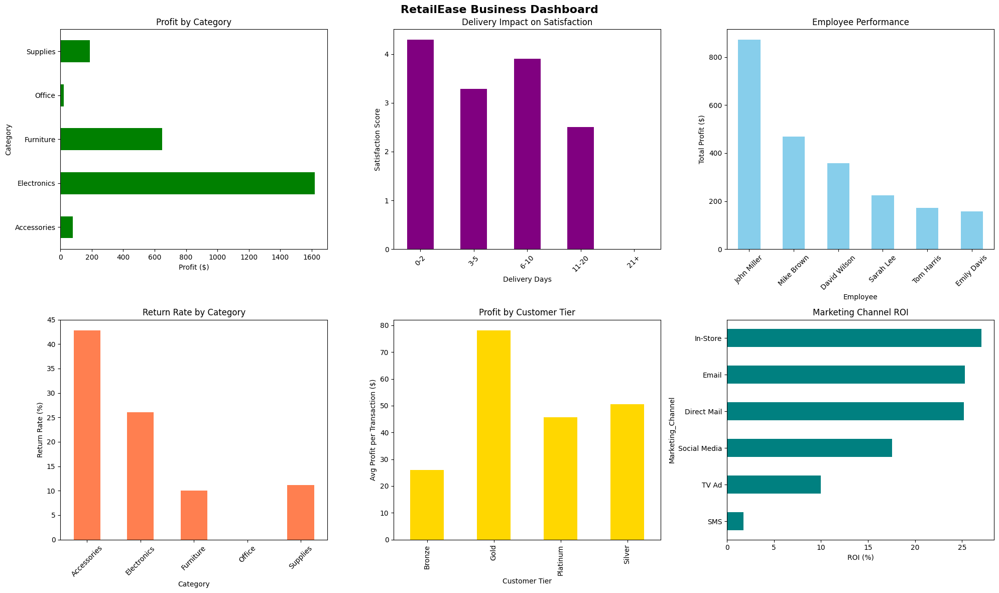
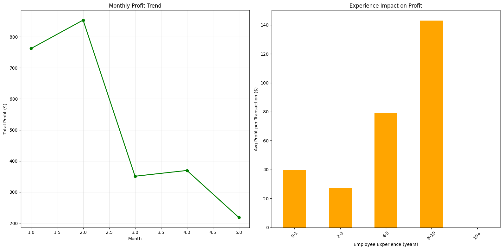

# Retail-Business-Analytics-Dashboard
Built an end-to-end Retail Business Analytics project using Python, Pandas, and Matplotlib. Cleaned messy real-world sales data, created dashboards, analyzed profit, returns, customer behavior, employee performance, and marketing ROI to generate actionable business insights and growth strategies. 
Retail Business Analytics Dashboard 📊

Project Overview

This project focuses on analyzing messy retail business data to generate meaningful business insights and recommendations.

Using Python and data analytics libraries, the raw dataset was cleaned, transformed, and visualized through interactive business dashboards.

The project identifies:

- Profitability trends
- High return-rate products
- Customer behavior
- Employee performance
- Marketing effectiveness
- Business growth opportunities

---

Objectives

- Clean inconsistent real-world business data
- Perform exploratory data analysis (EDA)
- Calculate revenue and profit metrics
- Analyze customer satisfaction and returns
- Build business dashboards for decision-making
- Generate actionable business insights

---

Tools & Technologies Used

- Python
- Pandas
- NumPy
- Matplotlib
- Data Cleaning
- Business Analytics

---

Dataset Features

The dataset contains:

- Transaction details
- Product categories
- Customer tiers
- Payment methods
- Employee performance
- Marketing channels
- Delivery information
- Return records

---

Key Insights 📈

- Electronics category showed a high return rate (26%)
- Accessories category generated losses
- Experienced employees generated higher profits
- Email marketing delivered strong ROI
- Premium customers contributed more profit

---

Business Recommendations 🚀

- Reduce product returns through quality checks
- Focus on high-profit product categories
- Improve employee training
- Scale email marketing campaigns
- Improve delivery efficiency

---

Future Improvements

- Build interactive dashboards using Power BI or Tableau
- Deploy dashboard using Streamlit
- Add machine learning for sales prediction
- Perform customer segmentation analysis

---

Author

Muzamil

